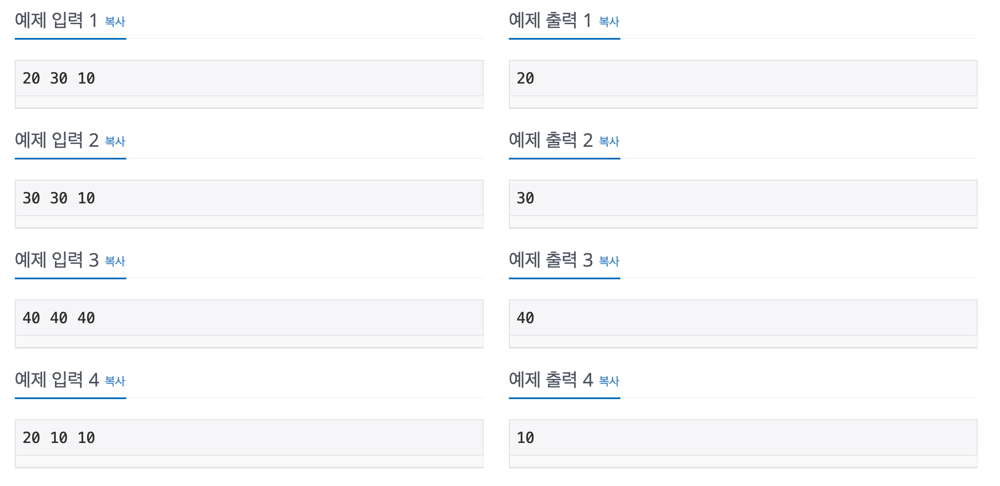

# 10817번: 세 수

| 시간 제한 | 메모리 제한 | 알고리즘 분류 |
|-----|--------|---------|
| 1 초 | 256 MB | 정렬 알고리즘 |

## 문제

> 세 정수 A, B, C가 주어진다. 이때, 두 번째로 큰 정수를 출력하는 프로그램을 작성하시오.

## 입력

> 첫째 줄에 세 정수 A, B, C가 공백으로 구분되어 주어진다. (1 ≤ A, B, C ≤ 100)

## 출력

> 두 번째로 큰 정수를 출력한다.

## 예제

